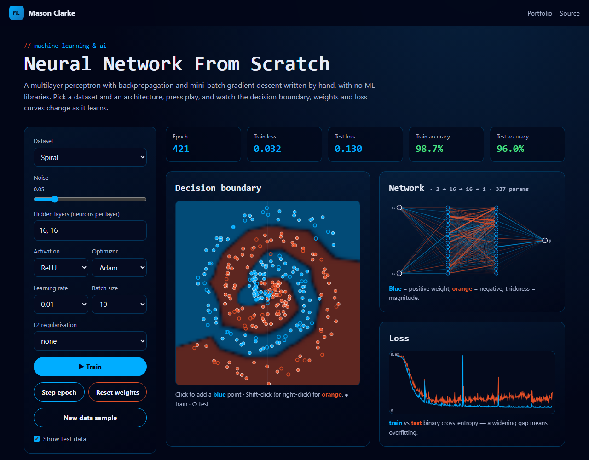

# Neural Network From Scratch

[](https://github.com/Masons-coding/neural-net-from-scratch/actions/workflows/ci.yml)

**Live demo → https://masons-coding.github.io/neural-net-from-scratch/**

A multilayer perceptron written from scratch in plain JavaScript, with **no ML libraries**. Forward pass, backpropagation, mini-batch gradient descent and the SGD, Momentum and Adam optimizers are all hand-written. It trains live in the browser while you watch the decision boundary, weights and loss curves change.



## Features

- Five datasets (circle, XOR, two clusters, two moons, spiral) with adjustable noise and a 75/25 train/test split
- Configurable architecture: up to 5 hidden layers of 1–16 neurons, with ReLU, tanh, sigmoid or linear activations
- **SGD, Momentum and Adam** optimizers, learning rate, batch size and L2 regularisation
- Live decision-boundary heatmap, network diagram (weight sign and magnitude), and train-vs-test loss curves that show overfitting
- Click the canvas to add your own training points

## Correctness, proven by tests

| Test | What it proves |
| --- | --- |
| **Gradient check** | Every backprop gradient matches a central-difference numerical estimate to within 1e-4 (tanh, sigmoid and ReLU) |
| Logistic regression on clusters | A network with no hidden layer learns a linearly separable problem |
| **XOR** | A linear model *fails* (< 75%) while a hidden layer solves it (> 95%), which is the classic motivation for deep learning |
| Circle with ReLU, spiral with Adam | Non-linear boundaries are learned to > 90% test accuracy |
| Reproducibility | Seeded initialisation and shuffling give identical runs |

## Computer-science concepts

- Backpropagation and the chain rule; sigmoid + cross-entropy gives an output error of `ŷ − y`
- Gradient descent variants: SGD, Momentum, Adam (bias-corrected moment estimates)
- Weight initialisation (He for ReLU, Xavier/Glorot for tanh and sigmoid)
- Overfitting vs generalisation, train/test split, L2 weight decay
- Numerical methods: gradient checking, Box-Muller Gaussian sampling, seeded PRNGs
- Rendering: offscreen low-resolution probability maps upscaled on `<canvas>`, SVG network diagrams

## Run locally

```bash
npx serve .    # no build step, no dependencies
npm test       # 13 tests including gradient checking
```

## Project structure

```
src/nn.js         Network class: forward, backprop, optimizers, loss, accuracy
src/datasets.js   seeded 2-D dataset generators + train/test split
src/main.js       training loop and canvas/SVG rendering
tests/nn.test.js  gradient checks and learning tests
```

---

Built by [Mason Clarke](https://masons-resume-website.netlify.app) · [LinkedIn](https://www.linkedin.com/in/mason-clarke/)
